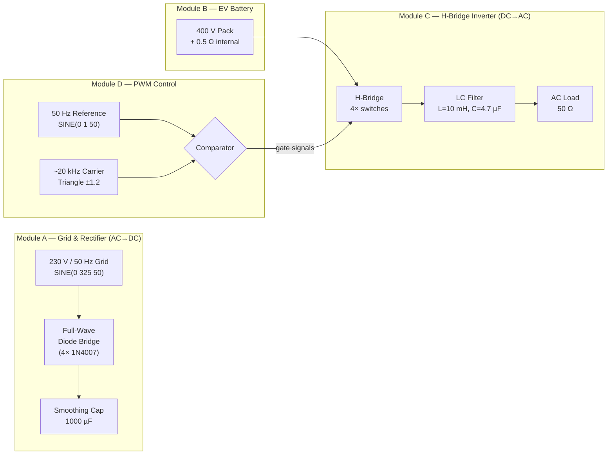
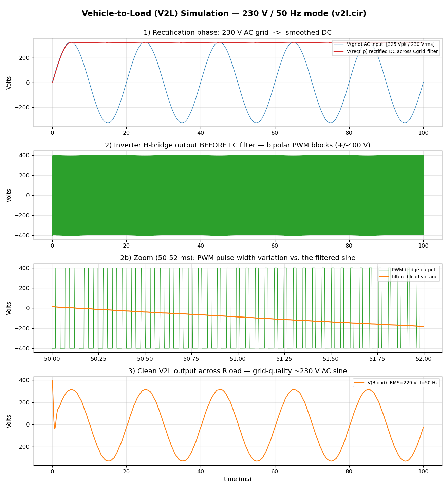
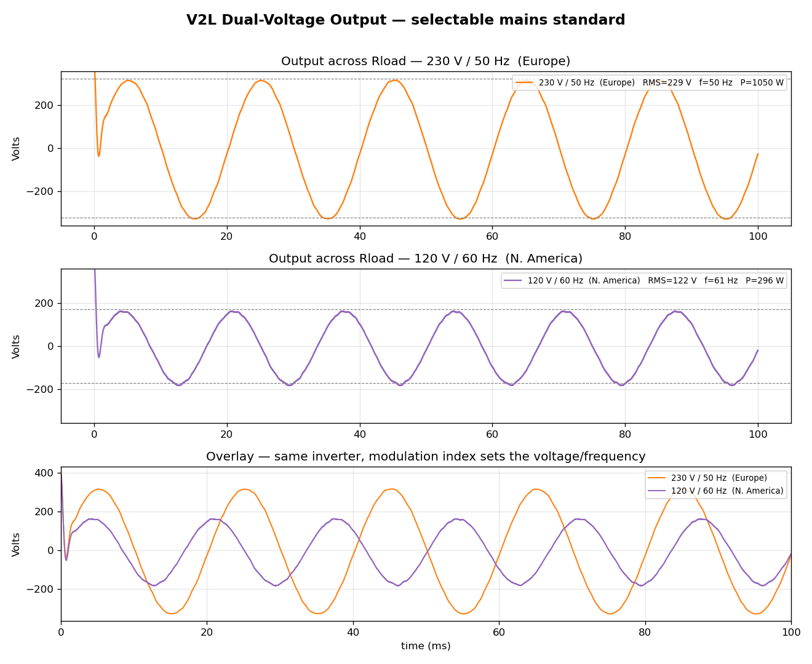

# Vehicle-to-Load (V2L) System Simulation

A complete SPICE model of a **Vehicle-to-Load (V2L)** power-electronics system, demonstrating
how an electric vehicle delivers grid-quality AC power to household appliances. The simulation
captures the full bidirectional energy path — **AC grid charging** of the traction battery and
**DC-to-AC inversion** that turns the battery into a 230 V / 50 Hz mains outlet.

Built and verified in **LTspice XVII**, with a Python post-processing pipeline for analysis and
visualization.

---

## Overview

Vehicle-to-Load lets an EV act as a mobile power source: the high-voltage traction battery is
inverted back to standard mains AC so it can run tools, appliances, or emergency loads. This
project models the two operating phases end-to-end:

1. **Grid charging (AC → DC).** A 230 V<sub>RMS</sub> / 50 Hz grid feeds a full-wave diode
   bridge and smoothing capacitor, conditioning AC into a stable DC rail.
2. **V2L discharge (DC → AC).** A 400 V battery drives an H-bridge inverter switched by
   20 kHz sinusoidal PWM; an LC low-pass filter reconstructs a clean AC sine across the load.
   The output is **dual-voltage selectable** — **230 V / 50 Hz** (Europe) or
   **120 V / 60 Hz** (North America) — chosen by a single mode parameter.

---

## System Architecture



The DC charging stage and the inverter stage are intentionally **decoupled** (the battery is
modeled as an ideal source), so each conversion can be observed independently — the rectifier
output is for demonstrating AC→DC conditioning, while the ideal 400 V pack feeds the inverter.

---

## Repository Structure

| File | Description |
| --- | --- |
| [`v2l.cir`](v2l.cir) | The complete, runnable SPICE netlist (all four modules + analysis directives). |
| [`plot_v2l.py`](plot_v2l.py) | Post-processor: parses the LTspice `.raw`, runs quantitative checks, renders the results figure. |
| [`v2l_results.png`](v2l_results.png) | Rendered waveforms for the three demonstration phases (230 V mode). |
| [`v2l_dual_voltage.png`](v2l_dual_voltage.png) | Comparison of the two selectable output standards (230 V/50 Hz vs 120 V/60 Hz). |
| [`CLAUDE.md`](CLAUDE.md) | Original step-by-step design specification (LTspice build guide). |
| `.gitignore` | Excludes regenerable simulation artifacts (`*.raw`, `*.log`, `*.net`). |

---

## Requirements

- **[LTspice XVII](https://www.analog.com/en/resources/design-tools-and-calculators/ltspice-simulator.html)** (free) — circuit simulation engine
- **Python ≥ 3.8** with:
  - `numpy`
  - `matplotlib`
  - `PyLTSpice`

```bash
pip install numpy matplotlib PyLTSpice
```

---

## Usage

**1. Run the circuit simulation** (batch mode, no GUI required):

```bash
# macOS
/Applications/LTspice.app/Contents/MacOS/LTspice -b v2l.cir

# Windows
"C:\Program Files\LTC\LTspiceXVII\XVIIx64.exe" -b v2l.cir
```

This produces `v2l.raw`, containing all node voltages and branch currents for the 100 ms
transient. The netlist is **stepped over both output modes** (`MODE = 1` and `MODE = 2`), so a
single run captures the 230 V / 50 Hz *and* 120 V / 60 Hz cases.

**2. Analyze and plot the results:**

```bash
python3 plot_v2l.py
```

This prints the quantitative verification table and writes [`v2l_results.png`](v2l_results.png).

> **Prefer the GUI?** Open the netlist directly with
> `open -a LTspice v2l.cir` (macOS), press **Run**, and probe nodes interactively.

---

## Simulation Results

The model reproduces grid-quality AC output, verified against design targets
(measured over the 20–100 ms settled window):

| Measurement | Simulated | Target | Status |
| --- | --- | --- | :---: |
| Grid AC peak | 325.0 V | ~325 V (230 V<sub>RMS</sub>) | ✅ |
| Rectified DC (across smoothing cap) | 320.1 V | Smoothed DC | ✅ |
| EV DC bus | 399.5 V | ~400 V | ✅ |
| **V2L output (RMS)** | **229.1 V** | **~230 V AC** | ✅ |
| Output frequency | 50.0 Hz | 50 Hz | ✅ |
| Delivered load power | ~1.05 kW | — | ✅ |



The figure shows the three demonstration phases:

1. **Rectification** — the grid AC sine conditioned into a flat DC rail.
2. **Inverter PWM** — the ±400 V bipolar pulse train at the H-bridge output, with a zoomed
   view revealing the sinusoidal pulse-width variation.
3. **Clean output** — the smooth ~230 V / 50 Hz sine delivered to the load after LC filtering.

---

## Dual-Voltage Output

Because the AC output is synthesized by the inverter (independent of the grid that charged the
battery), the output standard is set entirely by the **PWM modulation index** and **reference
frequency** — not by any hardware change. The output amplitude is linear in the modulation
index `M = V_ref / V_carrier`, so a single mode parameter selects the mains standard. The
netlist `.step`s over both in one simulation:

| Mode | Region | `MODE` | Measured RMS | Frequency | Load power (50 Ω) |
| :---: | --- | :---: | :---: | :---: | :---: |
| 1 | Europe / IEC | `1` | 229.1 V | 50.0 Hz | ~1.05 kW |
| 2 | North America | `2` | 121.7 V | 60.0 Hz | ~0.30 kW |



To pin the model to a single standard instead of sweeping both, delete the `.step` line in
[`v2l.cir`](v2l.cir) and set `.param MODE = 1` (or `2`) directly.

---

## Circuit Design Notes

**LC filter cutoff.** With `L = 10 mH` and `C = 4.7 µF`, the corner frequency is

$$f_c = \frac{1}{2\pi\sqrt{LC}} \approx 734\ \text{Hz}$$

comfortably above the 50 Hz fundamental and far below the ~20 kHz switching frequency, so the
filter passes the sine while rejecting the carrier.

**Modulation index.** The reference amplitude (1.0) over the carrier amplitude (1.2) gives
`M ≈ 0.83`, so the fundamental output is `M × 400 V ≈ 333 V` peak ≈ **235 V<sub>RMS</sub>** —
by design, close to nominal mains. Halving the modulation index (`M ≈ 0.43`, reference
amplitude 0.524) scales the output to **120 V<sub>RMS</sub>** for the North-America mode — see
[Dual-Voltage Output](#dual-voltage-output).

**Switch model.** The H-bridge uses ideal voltage-controlled switches
(`Ron = 0.01 Ω`, `Roff = 1 MΩ`, `Vt = 0.5`) for robust convergence, as recommended in the
design spec. Each leg's two switches are driven by complementary gate signals, eliminating
shoot-through. Discrete MOSFETs can be substituted for device-level fidelity.

**Known deviations from the spec.** Two minor inconsistencies in the original parameters are
preserved for fidelity, and are cosmetic for this demonstration:

- The PWM carrier's rise + fall + on time (25 µs + 25 µs + 1 µs = 51 µs) exceeds its 50 µs
  period, so LTspice auto-extends the period — the carrier runs at ~19.6 kHz rather than exactly
  20 kHz.
- The 50 Ω load dissipates **~1.05 kW** at 229 V<sub>RMS</sub> (the spec's "~1.8 kW" annotation
  would require ~28 Ω).

---

## How It Works

| Stage | Mechanism |
| --- | --- |
| **AC → DC** | A full-wave bridge rectifies both half-cycles; the 1000 µF capacitor smooths the pulsating DC into a near-constant rail. |
| **PWM generation** | A behavioral comparator compares the 50 Hz reference sine against the 20 kHz triangular carrier, producing complementary gate signals whose duty cycle traces the sine. |
| **DC → AC** | Diagonal H-bridge pairs switch the 400 V bus to ±400 V blocks (bipolar PWM); the average over each switching period follows the reference sine. |
| **Reconstruction** | The LC low-pass filter integrates the high-frequency pulse train, scrubbing the carrier and leaving a clean 230 V / 50 Hz sine for the load. |

---

## License

Provided for educational and demonstration purposes.
